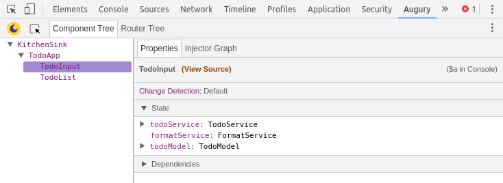

# Welcome to Augury

In this section you will learn what Augury is, and get introduced to the features that are available. Later lessons in this guide will go into more details, each lesson will explain Augury using a demo Angular application.

Augury is a Angular application inspection tools that runs in the Web browser. Augury runs as a Developer Tools (DevTools) browser _extension_, aiding in the analysis and debugging phases of development.

Augury provides better insight to an Angular application structure and the relationship between these building blocks:

* Components
* Services
* Routes
* Modules
* Dependencies
* Injectors
* Data bindings
* Events
* Object properties

Augury compliments DevTools during a debugging session, making it easy to modify states and emit events.

## Installing Augury

The best way to install Augury is to head over to [chrome web store](https://chrome.google.com/webstore/category/extensions?hl=en). Once there, select _Extensions_ from the side panel and type "Augury" into the search field, then press _Enter_.

The Augury extension similar to the following from _rangle.io_ should be visible.

When you click on "Add To Chrome", a _popup_ will open. Select "Add extension" to complete the process. Once the _plugin_ has been successfully installed, an Augury icon will appear next to the address bar in the browser.

The Augury icon provides additional information. Click on the icon now to discover what that is.

## Using Augury

To start using Augury, you must have an Angular application running in the browser for inspection. If you have never debugged a JavaScript application, you may not be aware that each modern Web browser provides a debug environment straight in the browser. _DevTools_, the debug environment is opened using the following _shortcut_:

* On Linux use `Ctrl + Shift + I`
* On Mac use `Cmd + Opt + I on Mac`
* On Windows use `Ctrl + Shift + I`

When DevTools is opened, you will find the Augury tab on the far right.

## Augury features

We will walk quickly through the main functionality that is available in Augury. This is to become familiar with the features and how to locate them when needed.

The first view that is visible is the _Component Tree_ which shows **loaded** components belonging to the application.

The component tree shows the hierarchal relationship of the _components_. When a _component_ is selected, Augury presents additional information about the _component_ in the _Properties_ tab.

Notable items of interest are:

1. View source link
1. Change Detection in use
1. Object properties
1. Dependencies

To view the source code of the selected _component_, click the 'View Source' link. This will bring the _Sources_ tab into focus and display the source code.

### Source map

One thing to keep in mind, the _TypeScript_ code will only be shown if a _source map_ from the build exists. In production if no _source map_ is available, what you will see is the compiled JavaScript code, which may also be minified and difficult to read.

Next to the _Properties_ tab is the _Injector Graph_, clicking on it will display the dependency of _components_ and _services_.

We will learn more on how to interpret the _ dependency graph_in later lessons.

The last major feature of Augury is the _Router Tree_ which displays the routing information for the application. The _Router Tree_ tab is located next to the _Component Tree_ tab along the top left side.

There are a few things we didn't cover here such as data binding and events which will be covered in other lessons. However you now have a good basic understand of Augury and how to start exploring it as well as all an Angular application.

Augury has evolved and improved over time since its debut, and it will continue to improve. We hope you come to love Augury and make it an indispensable tool in your toolbox. We love and welcome feedbacks, come join us on Slack [Angular Augury](https://augury-slack.herokuapp.com).