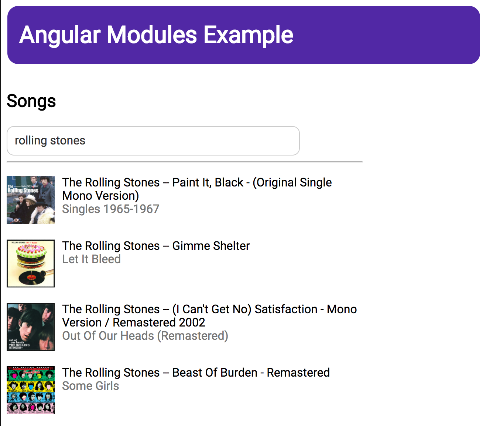
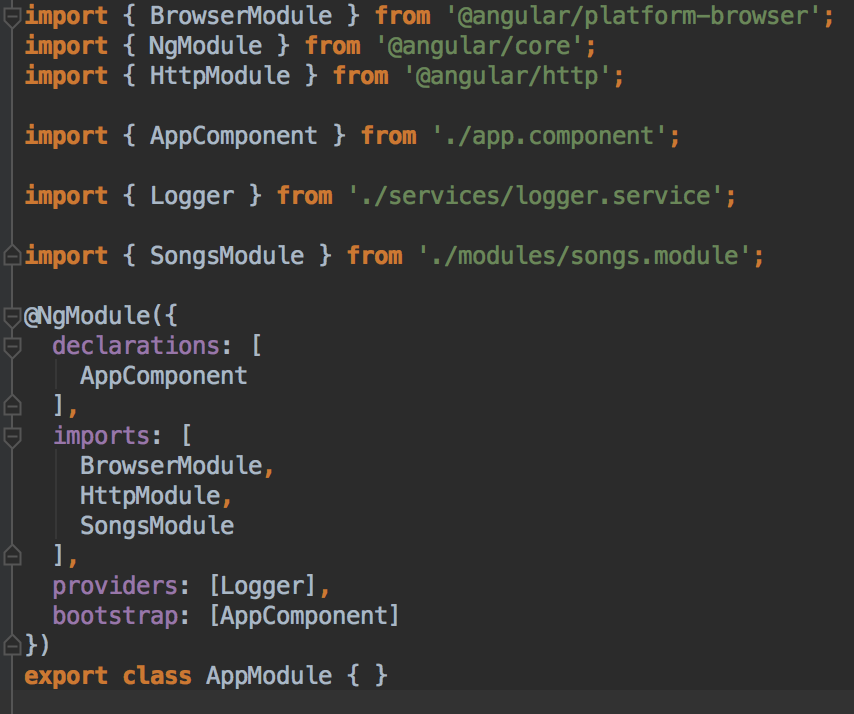
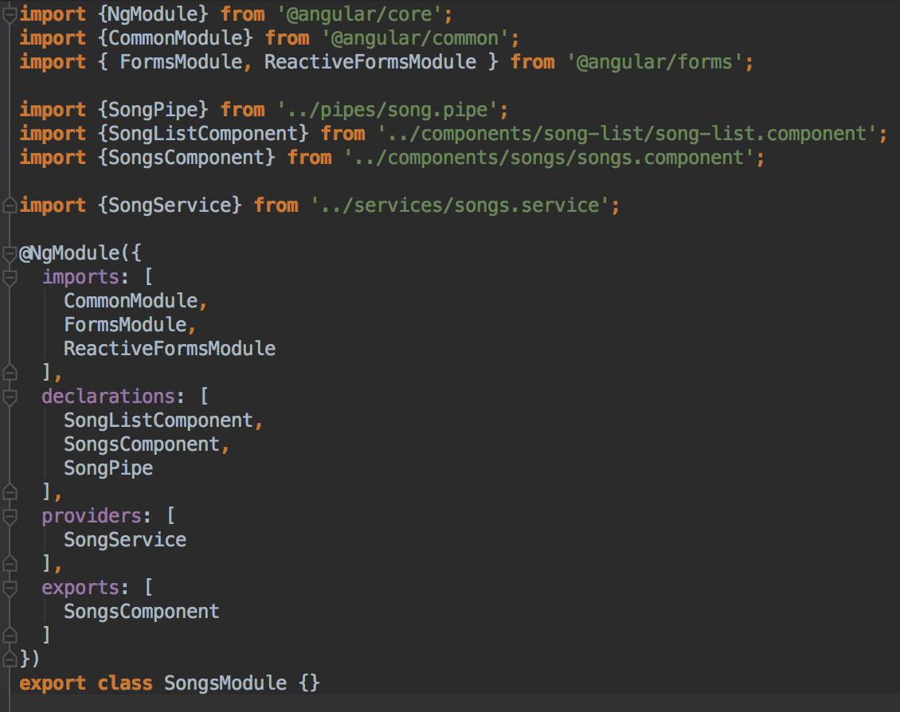
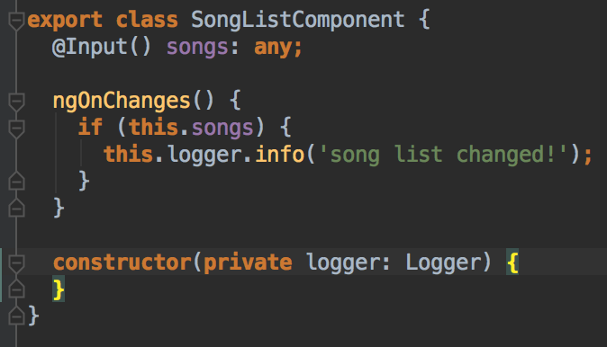
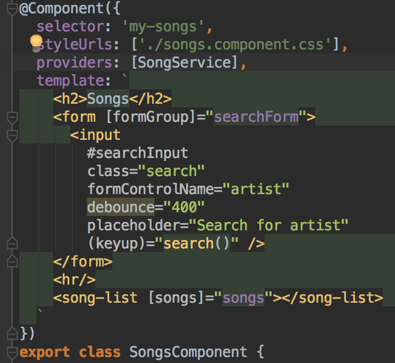

[Launch Demo App](https://augury.angular.io/examples/)

## Description

We'll use a simple Angular 2 application —  _Song List_ to examine how to use Augury's module list feature. The application includes a simple form for the user to search for songs and will use the public spotify API to get the results and display the album art and song title in a list. Pretty straightforward right? OK lets begin!


## Application Structure

The _Song List_ application is composed of 2 modules — the root application module which is used to bootstrap and launch the application, and a single feature module that contains the components, services and pipes relevant for the searching and displaying of song data. Lets take a look at how this is organized:


The Songs Module is a _feature_ module, which exports a component, `SongsComponent` that can be used throught out the application. This is used in the `AppComponent`, which is our root component that will bootstrap the application. Finally, this `AppComponent` is placed on the main `index.html` page and our application is up and running!

The architecture of the Song Module is pretty straightforward — the SongsComponent contains the search field in its template, and has the SongService injected as a dependency. When the user searches for a term, the SongService is invoked to perform a GET request, which returns an array of results. This dataset is passed to the SongListComponent which will use the SongPipe to display the album art, song title, and the name of the artist. 

Now that we understand the basic architecture of the _Song List_ application, lets open up Augury to get a breakdown of the applications modules using the Module List feature. 


## Opening Augury

To use Augury, lets open up DevTools with the following shortcut:

``` 
Ctrl + Shift + I (Cmd + Opt + I on Mac)
```

When the DevTools panel opens, select the **Augury** tab located on the far right. By default the _Component Tree_ tab will be open. To the far right, there will be a tab labelled _NgModules_. This is the section we want so click on it to open it up!

## Root Module


The Module List feature lists all the modules in our application. The first module in this list is the **AppModule**. Here we can see what _imports_, _exports_, _providers_, _declarations_, and _providers in declarations_ are found in the module. Our AppModule imports the BrowserModule (used for bootstrapping), HttpModule (used for performin network requests) and our feature module — SongsModule. Since the AppModule contains the applications root component it doesn't need to export anything. The AppModule has a single Provider — LoggerService, which is a simple service used for logging messages. Finally, the AppModule has one component — AppComponent which is the root component of our application and as such is the bootstrap entry point. 

Where does Augury get this information from? Well lets open up `app.module.ts` and take a look at the AppModule source code:



As you can see, the information that Augury has picked out and displayed in the Module List comes directly from the NgModule definition. 

Declarations are the components, directive and pipes used by the module. 

Imports are the other modules and their exported declarations that we want to be made available in this module. 

Providers are the services used by this module. Any service included as a provider in the NgModel definition becomes available to any other module in the hierarchical dependency injection system. For example, the SongsModule includeds the SongService as a provider, since AppModule has imported the SongsModule it can now use the SongService. If we omitted the SongService from the NgModel definition of the SongsModel and instead opted to include the SongService in the provider definition of the SongsComponent, the AppModule will **not** have access to the SongService. Dependency Injection is a topic outside the scope of this guide, but you can read more about it on the [Angular 2 Documentation](https://angular.io/docs/ts/latest/guide/hierarchical-dependency-injection.html)

So now that we've taken a look at the root module of our application, lets continue on to the other modules in Augury's module list:

## Library Modules

Angular 2 comes with a bunch of essential modules that we use for creating forms, making HTTP requests, and specifying what environment our application should run under. In our root module we imported the *BrowserModule* and *HttpModule*. 


Since library modules are static and never change, there really isn't much in the way of useful information here — particularly for this application. However there may come a time where you need to debug a certain library module and given the complexity and size of such modules getting a breakdown of its providers, exports and declarations may come in handy. 

## Feature Module

Finally, lets take a look at our feature module — SongsModule. 


As we can see, the Songs Module uses 3 library modules — FormsModule and ReactiveFormsModule are used for building the search form, and CommonModule contains many of the common directives used in the applications templates (ngIf, ngFor, etc). 

Since this is a feature module, it will be consumed and used by another module (in this case the root module). However not all declarations from the Song Module need to be used elsewhere. The SongListComponent and SongPipe are really only used within the Song Module, so we export our main container for this module — SongsComponent. 

The Song Module also uses the SongService as seen under the provider section. 

Lets take a look at the definition of the Song Module:



Cool, just like our root module, Augury has picked out the imports, declarations, providers and exports information from our module definition. 

One important thing to take note of is that module list does not include any resources (pipes, providers, directives, components, etc) that a module may use, just the resources definied by NgModule. For example, open up the SongListComponent (`components/song-list/song-list.component.ts`)



The SongListComponent uses the Logger service via dependency injection that has been made available from the AppModule. Since the AppModule is at the root of the applications dependency injection hierarchy, the SongListComponent can use any of its providers. However, since the Logger service is definied in the AppModule, Augury will list this service under the providers section of the AppModule and _not_ in the section of the SongsModule, even though the SongsModule consumes this service. To get a better sense of dependency injection through out our application we should use Augury's [Dependency Injection Tree](https://placeholder.com). 

Lets see what happens when we remove the SongService from the provider list in the SongModule definition and instead move it to the provider list in the SongsComponent component definition. 



Augury has picked up what we've done and has noticed that the SongService is not longer a provider from the module level, but instead from the component level. As we can see below, SongService is now under the ProvidersInDeclarations section. 


Pretty neat huh? This comes in handy as Auguary is able to pick up and list all services that a module provides, whether or not they are included in the module providers, or via specific component providers. 

